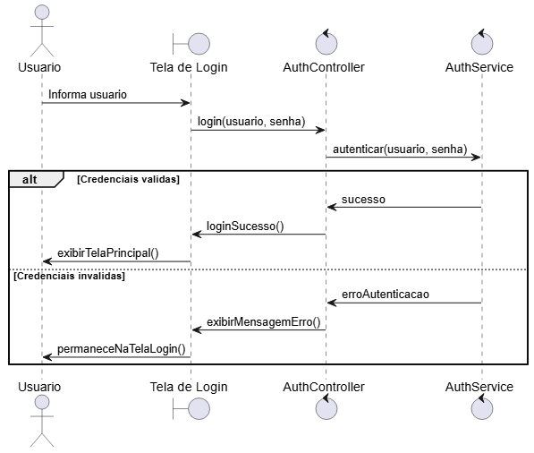
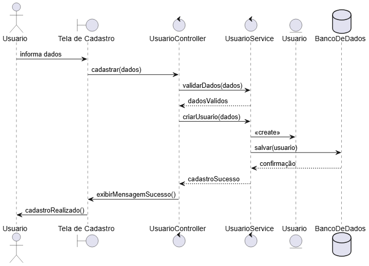
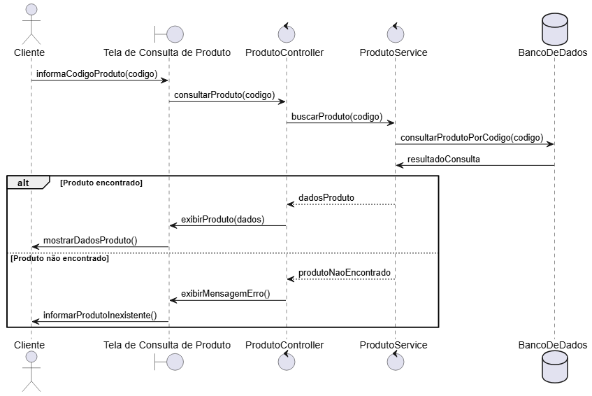
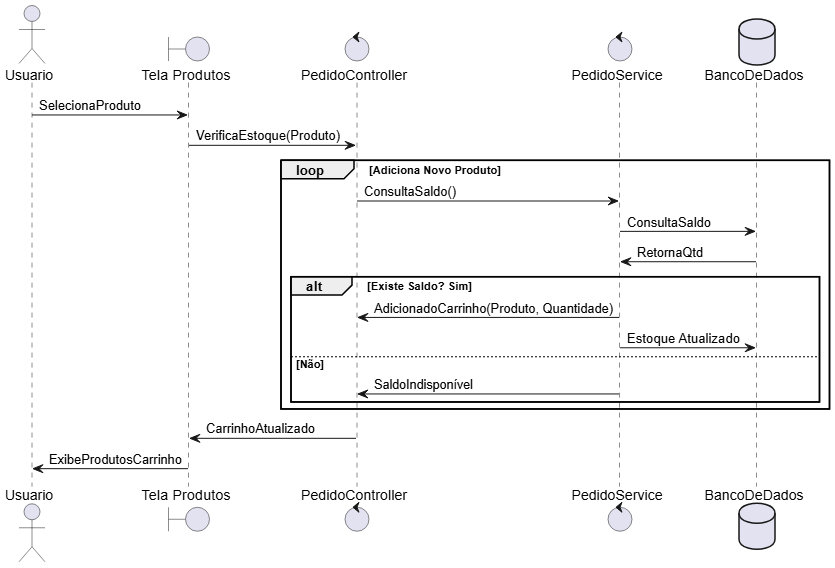

# Diagramas de Sequencia

### Exercício 01

### Exercício 02

### Exercício 03

### Exercício 04

### Exercício 05

### Exercício 06

### Exercício 07

### Exercício 08

### Exercício 09

### Exercício 10

